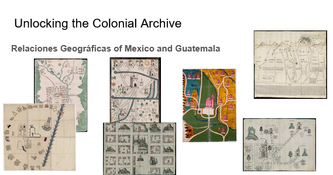
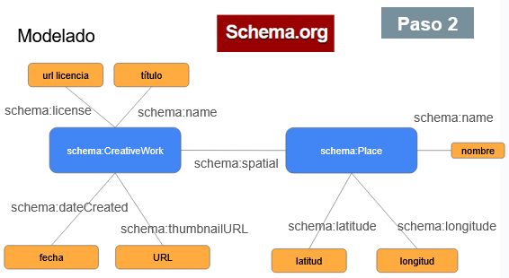

# Humanidades Digitales y descolonización
Este proyecto forma parte de los [Cursos de Verano UNED - 35.ª edición, Humanidades Digitales y descolonización](https://extension.uned.es/actividad/idactividad/36411).

Se basa en el trabajo realizado en el marco del proyecto [Unlocking the Colonial Archive](https://unlockingarchives.com/) realizado en colaboración con Lancaster University y la [Biblioteca Virtual Miguel de Cervantes](https://data.cervantesvirtual.com/noticia/an-ontological-approach-for-unlocking-the-colonial-archive).

### Colección de datos

Para este taller se han seleccionado un subconjunto de la colección [Relaciones Geográficas of Mexico and Guatemala](https://collections.lib.utexas.edu/?f%5Bmods_relatedItem_titleInfo_title_source_t%5D%5B%5D=Relaciones+Geogr%C3%A1ficas+of+Mexico+and+Guatemala) proporcionada por Benson Latin American Collection, LLILAS Benson Latin American Studies and Collections, The University of Texas at Austin. 

En concreto se han seleccionado [10 obras](input/manifests.txt) a través de sus manifests en formato JSON. La licencia de las obras es [Dominio Público](https://creativecommons.org/publicdomain/mark/1.0/).

### Instalación de herramientas
Para realizar este taller es necesario instalar las siguientes herramientas:

- [OpenRefine 3.6.0](https://github.com/OpenRefine/OpenRefine/releases/tag/3.6.0)
- Extensión [RDF Transform](https://openrefine.org/extensions), se descarga y se descomprime en la carpeta webapp/extensions de la carpeta de instalación de OpenRefine

Los Jupyter Notebooks incluidos en este taller se pueden ejecutar en un navegador (p.ej. utilizando [Binder](https://mybinder.org/)) sin necesidad de instalar ningún software adicional. Sin embargo, para desarrollar y ejecutar los Jupyter Notebooks en un ordenador personal es necesario instalar:

- [Anaconda](https://www.anaconda.com/download)

### Actividades

1. En primer lugar, ejecuta el Jupyter Notebook [notebooks/Extraccion_UCA2CSV.ipynb](https://nbviewer.org/github/hibernator11/uned-unlocking-workshop/blob/main/notebooks/Extraccion_UCA2CSV.ipynb) que transforma los datos originales (manifests en formato original JSON) a un fichero CSV (fichero de texto con columnas separadas por comas). Un fichero CSV es posible procesarlo fácilmente con la librería [pandas](https://pandas.pydata.org/).

2. El segundo paso consiste en modelar los datos extraídos con el vocabulario [Schema.org](https://schema.org) que proporciona clases y propiedades para describir los recursos. Para ello utilizamos la herramienta OpenRefine para leer el fichero CSV y generar como resultado un fichero en formato RDF.El fichero [openrefine/history.json](openrefine/history.json) incluye los pasos necesarios para transformar los datos proporcionados en el fichero CSV a RDF utilizando el vocabulario Schema.org. Como resultado obtenemos el fichero [output/UNED_metadatos_csv.ttl](output/UNED_metadatos_csv.ttl)

3. El tercer paso se basa en la reutilización de los datos generados en el paso anterior. El notebook [notebooks/SPARQLAnalysisDataset.ipynb](https://nbviewer.org/github/hibernator11/uned-unlocking-workshop/blob/main/notebooks/SPARQLAnalysisDataset.ipynb) muestra algunos ejemplos para consultar el repositorio generado.

### Referencias

- Gustavo Candela, Javier Pereda, Dolores Sáez, Pilar Escobar, Alexander Sánchez, Andrés Villa Torres, Albert A. Palacios, Kelly McDonough, and Patricia Murrieta-Flores. 2023. An Ontological Approach for Unlocking the Colonial Archive. J. Comput. Cult. Herit. 16, 4, Article 74 (December 2023), 18 pages. https://doi.org/10.1145/3594727
- Seth van Hooland, Ruben Verborgh, y Max De Wilde, "Limpieza de datos con OpenRefine", traducido por María-Jesús Colmenero-Ruiz, Programming Historian en español 1 (2017), https://doi.org/10.46430/phes0017
- https://humanidadesdigitaleshispanicas.es/compartir-pantalla-con-gustavo-candela-14-de-noviembre-de-2023/
- https://humanidadesdigitaleshispanicas.es/cafe-con-gustavo-candela-4-de-abril-de-2023/
- https://data.nls.uk/projects/the-national-librarians-research-fellowship-in-digital-scholarship-2022-23/
