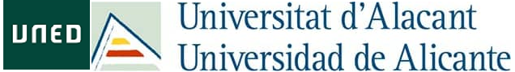

# Humanidades Digitales y descolonización
Este proyecto forma parte de los [Cursos de Verano UNED - 35.ª edición, Humanidades Digitales y descolonización](https://extension.uned.es/actividad/idactividad/36411).

Se basa en el trabajo realizado en el marco del proyecto [Unlocking the Colonial Archive](https://unlockingarchives.com/) realizado en colaboración con Lancaster University y la [Biblioteca Virtual Miguel de Cervantes](https://data.cervantesvirtual.com/noticia/an-ontological-approach-for-unlocking-the-colonial-archive).

### Colección de datos

### Instalación de herramientas

### Actividades

### Referencias
